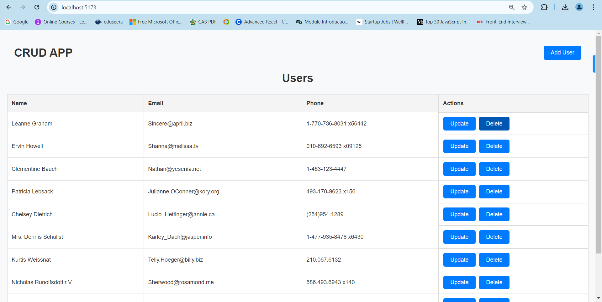
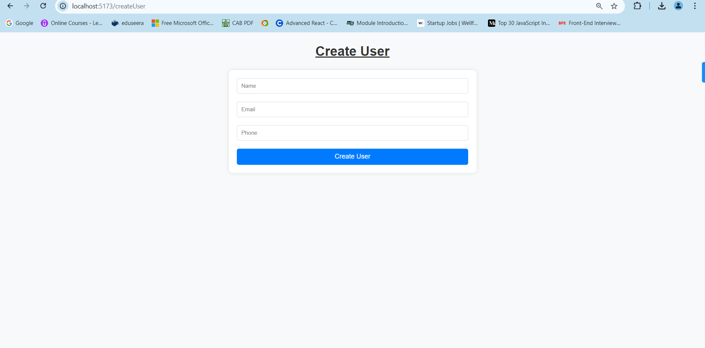
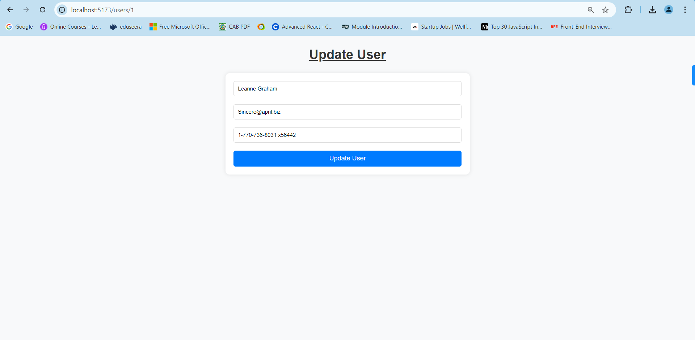

# React + Vite

This template provides a minimal setup to get React working in Vite with HMR and some ESLint rules.

Currently, two official plugins are available:

- [@vitejs/plugin-react](https://github.com/vitejs/vite-plugin-react/blob/main/packages/plugin-react/README.md) uses [Babel](https://babeljs.io/) for Fast Refresh
- [@vitejs/plugin-react-swc](https://github.com/vitejs/vite-plugin-react-swc) uses [SWC](https://swc.rs/) for Fast Refresh

# React CRUD App

This project is a simple yet fully functional CRUD (Create, Read, Update, Delete) application built using React. It uses JSONPlaceholder as a simulated backend to fetch, create, update, and delete users.

## Features

Fetch users and display in a responsive table.
Add new users.
Edit existing users.
Delete users from the list.
Utilizes React Router for navigation between pages.
Fully responsive design, optimized for both mobile and desktop.
Includes a loading spinner to indicate data fetching.

# Installation

## Clone the repository:

git clone https://github.com/Sachinnegi825/CRUD-App.git

## Navigate to the project directory

cd CRUD App

## Install dependencies:

npm install

# Running the Application

To start the development server:
npm run dev

Visit http://localhost:3000 to view the application.

## Building for Production

To create an optimized production build:
npm run build

# Usage

## Fetch Users

Users are fetched from the JSONPlaceholder API and displayed in a responsive table.

## Create User

Navigate to the "Add User" page to create a new user.

## Update User

Each user has an "Edit User" button. Click it to update a user's details via a pre-filled form.

## Delete User

Each user has a "Delete User" button. Clicking it will remove the user from the list.

## For Reference(Images)

## Home Page

## Create User Page

## Update User Page

